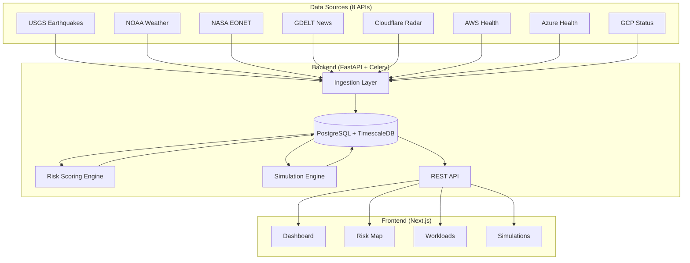
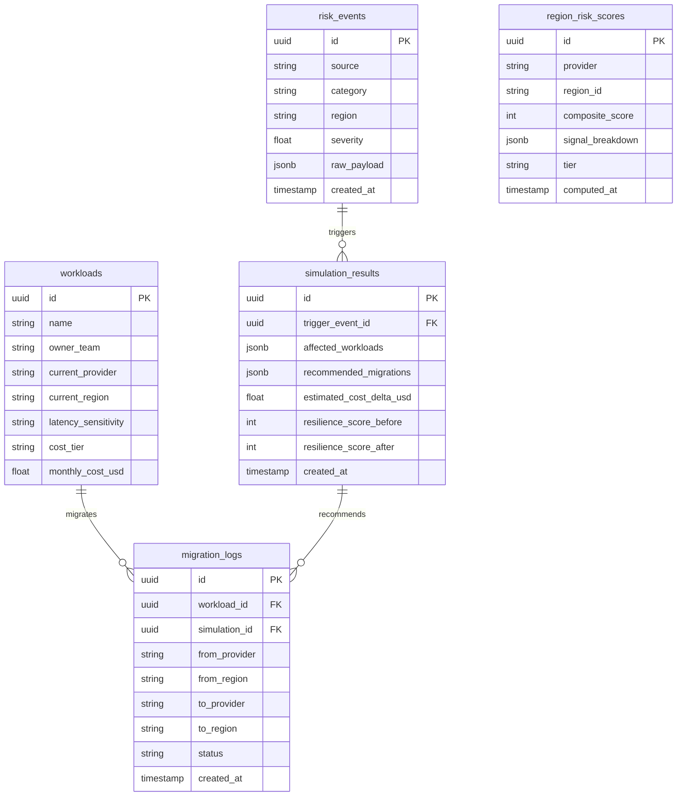

# NimbusGuard — Complete Project Walkthrough

> Everything you need to know to understand, run, and present the platform.

---

## 1. The Core Thesis (What to Tell Judges)

NimbusGuard solves **two problems simultaneously** that everyone else solves separately:

1. **Cloud costs are out of control** — workloads sit in expensive regions when cheaper alternatives exist across providers
2. **Disaster response is reactive** — teams only move workloads *after* an outage, not before

**NimbusGuard's key insight:** The same migration that protects you from an earthquake *also* saves you money. Cost optimization and resilience are not trade-offs — they're the same action.

---

## 2. Architecture Overview



---

## 3. The Data Flow (Step by Step)

### Step 1: Signal Ingestion
**Every 5 minutes**, Celery Beat triggers ingestion tasks:

| Task | What it does | File |
|---|---|---|
| `ingest_eonet` | Pulls active natural disasters from NASA | [eonet.py](file:///x:/Projects/Haackathons/NimbusGuard/backend/ingestion/eonet.py) |
| `ingest_noaa` | Pulls active weather alerts from NOAA | [noaa.py](file:///x:/Projects/Haackathons/NimbusGuard/backend/ingestion/noaa.py) |
| `ingest_usgs` | Pulls seismic events from USGS | [usgs.py](file:///x:/Projects/Haackathons/NimbusGuard/backend/ingestion/usgs.py) |
| `ingest_gdelt` | Pulls geopolitical news sentiment from GDELT | [gdelt.py](file:///x:/Projects/Haackathons/NimbusGuard/backend/ingestion/gdelt.py) |
| `ingest_cloudflare` | Pulls BGP hijack/anomaly data | [cloudflare.py](file:///x:/Projects/Haackathons/NimbusGuard/backend/ingestion/cloudflare.py) |
| `ingest_aws/azure/gcp` | Pulls cloud provider health status | [aws.py](file:///x:/Projects/Haackathons/NimbusGuard/backend/ingestion/aws_health.py), etc. |

Each ingestion module:
1. Calls an external API
2. Normalizes the response into a `RiskEvent` record
3. Maps the event to the nearest cloud region (e.g., Oregon earthquake → `us-west-2`)
4. Saves to `risk_events` table with: source, category, region, severity (0.0–1.0), raw_payload

### Step 2: Risk Scoring
**Every 5 minutes** (right after ingestion), the scoring task runs:

File: [scorer.py](file:///x:/Projects/Haackathons/NimbusGuard/backend/core/scorer.py)

For **each of the 30 cloud regions** across all 3 providers:
1. Query all `RiskEvents` for that region in the last 24 hours
2. Group by category (infrastructure, natural_disaster, geopolitical, cyber)
3. Compute weighted composite score:

```python
composite = (
    0.45 × infrastructure +    # Highest weight — direct impact
    0.30 × natural_disaster +  # Physical threats
    0.15 × geopolitical +      # Weak signal, early warning
    0.10 × cyber               # BGP/DDoS anomalies
) × 100
```

4. Assign a tier:
   - **0–39** → NORMAL (green)
   - **40–59** → WATCH (yellow)
   - **60–79** → WARNING (orange) — migration recommended
   - **80–100** → CRITICAL (red) — immediate action

5. Save to `region_risk_scores` table (time-series via TimescaleDB)

Weights are defined in: [weights.py](file:///x:/Projects/Haackathons/NimbusGuard/backend/core/weights.py)

### Step 3: Simulation (On-Demand)
When a user clicks "Run Simulation" on the frontend:

File: [simulator.py](file:///x:/Projects/Haackathons/NimbusGuard/backend/core/simulator.py)

1. **Input:** A `RiskEvent` ID (e.g., the Oregon earthquake)
2. **Find affected workloads:** All workloads in the event's region
3. **For each workload, score every migration candidate:**
   - Cross-provider targets from [REGION_EQUIVALENTS](file:///x:/Projects/Haackathons/NimbusGuard/backend/core/regions.py#L28-L41) (e.g., `us-west-2` → Azure `westus2`, GCP `us-west1`)
   - Same-provider, different region (e.g., `us-east-1`, `us-east-2`)
   - **Filter out** any candidate in WARNING or CRITICAL tier
   - **Compliance check** — if workload has compliance_region, skip non-matching
   - **Latency penalty** — if workload is high-sensitivity and target is different continent, add penalty
4. **Score each candidate:**
```python
migration_score = (
    -0.5 × cost_normalized +      # Lower cost = better
    -0.3 × latency_penalty +      # Same continent preferred
     0.2 × risk_benefit            # Lower risk score = better
)
```
5. **Pick the best** for each workload
6. **Compute resilience before vs after** — weighted average of (100 - risk_score) across workloads
7. **Save** `SimulationResult` with recommended_migrations, cost_delta, resilience scores

### Step 4: Frontend Display
The dashboard polls the API every 30 seconds via SWR and renders:
- **Stat cards** — live counts from risk scores and workloads
- **Alert feed** — recent RiskEvents with severity bars
- **Cost/Resilience card** — latest simulation before/after
- **Workload table** — current workloads with risk tier badges
- **Map** — Leaflet markers colored by tier

---

## 4. Database Schema

5 tables, all with UUID primary keys:



> [!NOTE]
> `region_risk_scores` is a TimescaleDB hypertable partitioned on `computed_at`. This stores the full time-series of scores so you can see how risk evolved over time.

---

## 5. API Surface

Base URL: `http://localhost:8000`

| Method | Endpoint | What it does |
|---|---|---|
| `GET` | `/health` | System health — DB, Redis, Celery status |
| `GET` | `/api/signals` | List risk events (filterable by category, region, limit) |
| `GET` | `/api/risk-scores` | Latest risk score per region, grouped by provider |
| `GET` | `/api/risk-scores/{provider}/{region}` | Historical scores for one region |
| `POST` | `/api/risk-scores/refresh` | Force re-score all regions now |
| `GET` | `/api/workloads` | List all workloads |
| `POST` | `/api/workloads` | Create a workload |
| `POST` | `/api/simulate` | Run a simulation (body: `{event_id}`) |
| `GET` | `/api/simulate` | List past simulations |
| `GET` | `/api/migrations` | List migration logs |
| `PATCH` | `/api/migrations/{id}/approve` | Approve a migration |
| `PATCH` | `/api/migrations/{id}/execute` | Execute a migration |

Every response follows this envelope:
```json
{
  "data": <payload>,
  "error": null,
  "timestamp": "2026-03-28T00:41:04Z"
}
```

Interactive docs: **http://localhost:8000/docs** (Swagger UI)

---

## 6. Frontend Structure

```
frontend/src/
├── app/
│   ├── layout.tsx          ← Root layout with NavBar
│   ├── page.tsx            ← Dashboard (stat cards, alert feed, cost card, table)
│   ├── map/page.tsx        ← Leaflet world map with colored markers
│   ├── workloads/page.tsx  ← Workload CRUD with inline form
│   └── simulations/page.tsx ← Simulation runner + history table
├── components/
│   ├── NavBar.tsx           ← Sticky glassmorphism nav with LiveBadge
│   ├── LiveBadge.tsx        ← Pulsing green "● LIVE" indicator
│   ├── TierBadge.tsx        ← NORMAL/WATCH/WARNING/CRITICAL badge
│   ├── ProviderBadge.tsx    ← AWS/Azure/GCP colored badge
│   ├── StatCard.tsx         ← Metric card with glow accent
│   ├── AlertFeed.tsx        ← Live signal feed with severity bars
│   ├── WorkloadTable.tsx    ← Workloads with risk tier + cost
│   ├── CostResilienceCard.tsx ← Before/after simulation impact
│   ├── SimulationPanel.tsx  ← Event selector + run button
│   └── RiskMap.tsx          ← Leaflet map (dynamic import, SSR disabled)
└── lib/
    ├── api.ts               ← 11 typed API functions
    ├── store.ts             ← Zustand global state
    ├── types.ts             ← TypeScript interfaces (matches backend schemas)
    ├── regionCoords.ts      ← Lat/lon for 30 cloud regions
    └── utils.ts             ← formatRelativeTime, formatUSD, formatCostDelta
```

### Key Patterns
- **SWR** for all data fetching (30s refresh, deduping)
- **Zustand** for cross-page state (selected region from map → dashboard filter)
- **Dynamic imports** for Leaflet (`ssr: false`) — avoids hydration errors
- **Skeleton loaders** — shimmer animation, not spinners, for initial loads

---

## 7. The 30 Cloud Regions

Defined in [regions.py](file:///x:/Projects/Haackathons/NimbusGuard/backend/core/regions.py):

| Provider | Regions | Count |
|---|---|---|
| **AWS** | us-east-1, us-east-2, us-west-1, us-west-2, eu-west-1, eu-west-2, eu-central-1, ap-southeast-1, ap-southeast-2, ap-northeast-1, ap-south-1, sa-east-1 | 12 |
| **Azure** | eastus, eastus2, westus, westus2, northeurope, westeurope, southeastasia, eastasia, brazilsouth | 9 |
| **GCP** | us-central1, us-east1, us-west1, europe-west1, europe-west2, asia-southeast1, asia-east1, asia-south1, southamerica-east1 | 9 |

Each region has:
- **Cost multiplier** relative to us-east-1 (baseline 1.0) — used to estimate migration cost impact
- **Continent code** (NA, EU, AP, SA) — used for latency penalty on high-sensitivity workloads
- **Cross-provider equivalents** — e.g., `us-west-2` ↔ Azure `westus2` ↔ GCP `us-west1`

---

## 8. The Demo Scenario (What the Seed Creates)

When you run `docker-compose exec backend python -m backend.db.seed`:

### 6 Risk Events

| # | Source | Category | Region | Severity | Story |
|---|---|---|---|---|---|
| 1 | usgs | natural_disaster | us-west-2 | 0.85 | **M6.2 earthquake in Oregon** ← Primary demo trigger |
| 2 | noaa | natural_disaster | us-east-1 | 0.70 | Hurricane warning, NC coast |
| 3 | gdelt | geopolitical | eu-central-1 | 0.55 | Infrastructure tensions, Central Europe |
| 4 | aws_health | infrastructure | ap-southeast-1 | 0.80 | EC2 degraded in Singapore |
| 5 | cloudflare | cyber | eu-west-1 | 0.65 | BGP hijack, Ireland |
| 6 | usgs | natural_disaster | ap-northeast-1 | 0.45 | M4.8 quake in Tokyo (6h ago, resolved) |

### Risk Score Highlights

| Region | Score | Tier | Why |
|---|---|---|---|
| aws/ap-southeast-1 | **82** | 🔴 CRITICAL | EC2 degraded |
| aws/us-west-2 | **78** | 🟠 WARNING | M6.2 earthquake |
| aws/us-east-1 | **62** | 🟠 WARNING | Hurricane |
| aws/eu-central-1 | **48** | 🟡 WATCH | Geopolitical tension |
| aws/eu-west-1 | **44** | 🟡 WATCH | BGP hijack |
| azure/eastus | **22** | 🟢 NORMAL | Migration target |
| gcp/us-central1 | **18** | 🟢 NORMAL | Migration target |
| aws/us-east-2 | **25** | 🟢 NORMAL | Migration target |

### 3 Workloads (All in us-west-2, the earthquake zone)

| Workload | Team | Sensitivity | Cost | Tier |
|---|---|---|---|---|
| Payments API | Platform Engineering | High | $1,200/mo | Critical |
| ML Training Job | Data Science | Low | $3,400/mo | Standard |
| Auth Service | Security | High | $890/mo | Critical |

### Pre-Run Simulation Result
The seed automatically runs a simulation against Event 1 (the earthquake). This pre-populates the CostResilienceCard so the dashboard shows data immediately.

---

## 9. Docker Services

```yaml
# docker-compose.yml — 6 services
postgres:     # PostgreSQL 15 + TimescaleDB    (port 5432)
redis:        # Redis 7                         (port 6379)
backend:      # FastAPI + Uvicorn               (port 8000)
frontend:     # Next.js dev server              (port 3000)
celery_worker: # Celery worker (prefork, 4)     (background)
celery_beat:   # Celery beat scheduler           (background)
```

Health dependencies: `frontend` → `backend` → `postgres` + `redis`

---

## 10. Key Files to Know

| Purpose | File | One-line description |
|---|---|---|
| **Entry point** | [main.py](file:///x:/Projects/Haackathons/NimbusGuard/backend/main.py) | FastAPI app, CORS, router registration |
| **Risk Scoring** | [scorer.py](file:///x:/Projects/Haackathons/NimbusGuard/backend/core/scorer.py) | Weighted composite scoring per region |
| **Simulation** | [simulator.py](file:///x:/Projects/Haackathons/NimbusGuard/backend/core/simulator.py) | Migration candidate scoring + cost delta |
| **Weights** | [weights.py](file:///x:/Projects/Haackathons/NimbusGuard/backend/core/weights.py) | Category weights (0.45/0.30/0.15/0.10) |
| **Regions** | [regions.py](file:///x:/Projects/Haackathons/NimbusGuard/backend/core/regions.py) | 30 regions + equivalents + cost multipliers |
| **Celery** | [celery_app.py](file:///x:/Projects/Haackathons/NimbusGuard/backend/tasks/celery_app.py) | Beat schedule (every 5 min) |
| **Seed** | [seed.py](file:///x:/Projects/Haackathons/NimbusGuard/backend/db/seed.py) | Full demo dataset + auto-simulation |
| **API Client** | [api.ts](file:///x:/Projects/Haackathons/NimbusGuard/frontend/src/lib/api.ts) | 11 typed fetch functions |
| **Dashboard** | [page.tsx](file:///x:/Projects/Haackathons/NimbusGuard/frontend/src/app/page.tsx) | Stat cards + alert feed + cost card + table |
| **Map** | [RiskMap.tsx](file:///x:/Projects/Haackathons/NimbusGuard/frontend/src/components/RiskMap.tsx) | Leaflet map with tier-colored markers |

---

## 11. Common Commands

```bash
# Start everything
docker-compose up --build

# Seed demo data (ALWAYS run before demo)
docker-compose exec backend python -m backend.db.seed

# Full reset (drop tables + recreate + reseed)
docker-compose exec backend python -m backend.db.reset

# Check health
curl http://localhost:8000/health

# Run simulation via API
curl -X POST http://localhost:8000/api/simulate \
  -H "Content-Type: application/json" \
  -d '{"event_id": "<uuid-from-seed>"}'

# View logs
docker-compose logs -f backend
docker-compose logs -f celery_worker

# Stop everything
docker-compose down
```

---

## 12. Before the Demo — Checklist

> [!IMPORTANT]
> **Always reseed right before the demo.** Celery ingestion tasks will overwrite seed scores with real (mostly 0) values. Reseed to restore the demo data with proper CRITICAL/WARNING scores.

```bash
docker-compose up -d          # 1. Start all services
docker-compose exec backend python -m backend.db.seed  # 2. Seed
# Open http://localhost:3000 in fullscreen               # 3. Go
```

### Verify these on the dashboard:
- [ ] 30 regions, 1 CRITICAL, 2 WARNING in stat cards
- [ ] 6 signals in AlertFeed (all 5 categories)
- [ ] CostResilienceCard shows before/after scores
- [ ] Workloads show WARNING tier + "At Risk" status
- [ ] Map has orange/red/yellow/green markers

---

## 13. What to Say to Judges

### Opening (15 seconds)
> "NimbusGuard is a multi-cloud orchestration platform that simultaneously optimizes for cost and resilience. It ingests 8 live data feeds, scores every cloud region, and when risk spikes, it tells you exactly what to move, where, and what you save."

### The Key Metric
> "In our demo: a single earthquake triggers recommendations that improve resilience from 22 to 78 AND save $366/month. The same action that protects you also saves money."

### Differentiator
> "AWS Cost Explorer optimizes cost within one provider. PagerDuty alerts after an outage. Nobody connects real-world risk signals to cross-provider cost optimization in a single system. That's what NimbusGuard does."

### If Asked About Accuracy
> "Infrastructure signals carry 45% weight — those are factual health status from cloud providers. Geopolitical signals carry only 10% — we treat them as early-warning context, not triggers. The model is intentionally conservative."

---

## 14. Known Gotchas

> [!WARNING]
> **Celery overwrites scores:** The background ingestion + scoring runs every 5 minutes. If real APIs return no events (common), scores drop to 0. **Always reseed before demo.**

> [!NOTE]
> **GDELT rate limits:** The GDELT API returns 429 (rate limit) frequently. The ingestion task catches this and skips gracefully — it's logged but doesn't crash.

> [!NOTE]
> **Simulation cost delta varies slightly** each time you seed because the non-demo regions get random scores (10–35 range). The overall narrative (savings + resilience improvement) stays consistent.
